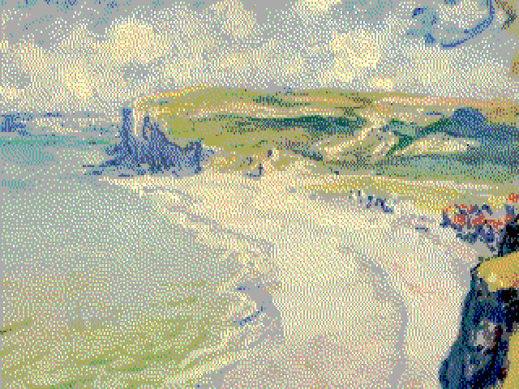

# retroimg

[](https://crates.io/crates/retroimg) [](https://github.com/Enet4/retroimg/actions/workflows/ci.yml) [](https://deps.rs/repo/github/Enet4/retroimg)

Convert images to appear to be reproduced on retro IBM hardware.

| original (640x480, 24-bit RGB) | VGA (320x200, 256 colors, 4:5 pixels) | EGA (320x200, 16 colors, 4:5 pixels) | CGA (320x200, 4 colors + bkg) |
|--------------------------------|---------------------------------------|--------------------------------------|----------------|
|      |         |        |  |
|          |             |            |  |

The full image processing pipeline is composed of the following steps:

1. Image cropping and resizing to a low resolution;
2. Master palette color quantization and mapping to a restricted color palette, plus color limit with dithering;
3. Nearest-neighbor resizing to a high resolution, to make pixels look good, also enabling non-square pixels.

**Note:** This application does not claim to achieve a perfect emulation of old hardware,
but it should hopefully attain sufficiently good results for the intended nostalgia kick.

## Using the tool

The main options are:

- `-s` | `--standard`: the video graphics standard to emulate.
   This only affects the colors used, not the image resolution.
   Possible options:
  - `bw`: 1 bit, black and white
  - `cga` or `cgamode4`: CGA in mode 4, attempts to choose
    the best sub-palette and background color
  - `fullcga`: all 16 colors of the CGA master palette
  - `cgamode4high1`: CGA in mode 4, always subpalette 1 of high intensity
    (black, magenta, white, black)
  - `ega`: all 64 colors from the EGA master palette
  - `16bit`: 16-bit color depth (4-5-4 RGB)
  - `vga` (default) or `18bit`: 18-bit master palette
  - `true` or `24bit`: 24-bit RGB color depth
- `-R WxH`: the resolution to resize the image into.
- `-S WxH`: the full image output size, resized from the previous option.

To convert an image to look like it was presented in VGA mode 13h,
with non-square pixels:

```sh
retroimg «IMAGEFILE» -s vga -R 320x200 -S 1440x1080 -o «out.png»
```

This chooses the 256-color palette with the least loss.
To use less colors (e.g. 100):

```sh
retroimg «IMAGEFILE» -s vga -R 320x200 -S 1440x1080 -c 100 -o «out.png»
```

To choose an output width or height
and let the program pick the other dimensions
based on pixel ratio:

```sh
retroimg «IMAGEFILE» -s vga -R 320x200 --height 1080 -r 4:5 -o «out.png»
```

This will stretch the image proportionally to the pixel size 4:5,
meaning that it works best for images designed for this.

The full list of options is presented via `retroimg -h` or `retroimg --help`.

## Using the library

The operations required for doing this
are available as independent functions.

To remove dependencies related with the command line application,
exclude the default feature `cli`.

```toml
[dependencies.retroimg]
version = "0.2"
default-features = false
```

## License

Licensed under either of

- Apache License, Version 2.0, ([LICENSE-APACHE](LICENSE-APACHE) or <http://www.apache.org/licenses/LICENSE-2.0>)
- MIT license ([LICENSE-MIT](LICENSE-MIT) or <http://opensource.org/licenses/MIT>)

at your option.

Unless you explicitly state otherwise, any contribution intentionally submitted
for inclusion in the work by you, as defined in the Apache-2.0 license, shall be dual licensed as above, without any
additional terms or conditions.
